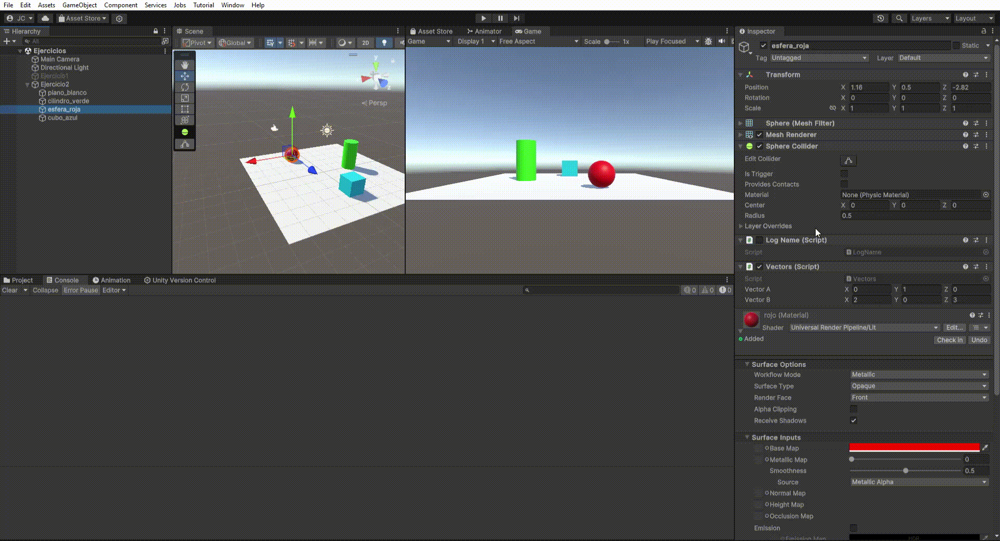

# Introducción C# - Scripts

## 1


## 2


## 3


## 4


## 5
**Nota**: se interpreta que lo que se pide es la distancia entre el cubo y el cilindro, mediante un script en la esfera.


## 6
Se emplea el método *Input.GetAxis("Jump");* para detectar en cada actualización de Update si se ha pulsado la barra espaciadora.


## 7
Se emplean los métodos *GetKeyDown* para detectar las teclas oportunas (con su código respectivo) comprobando el método en *Update*.


## 8
Se emplea el método ```FindGameObjectsWithTag``` para obtener todos los GameObjects con etiqueta "esfera_tipo2". Sobre este array se calcula la esfera más cercana y la más lejana.

